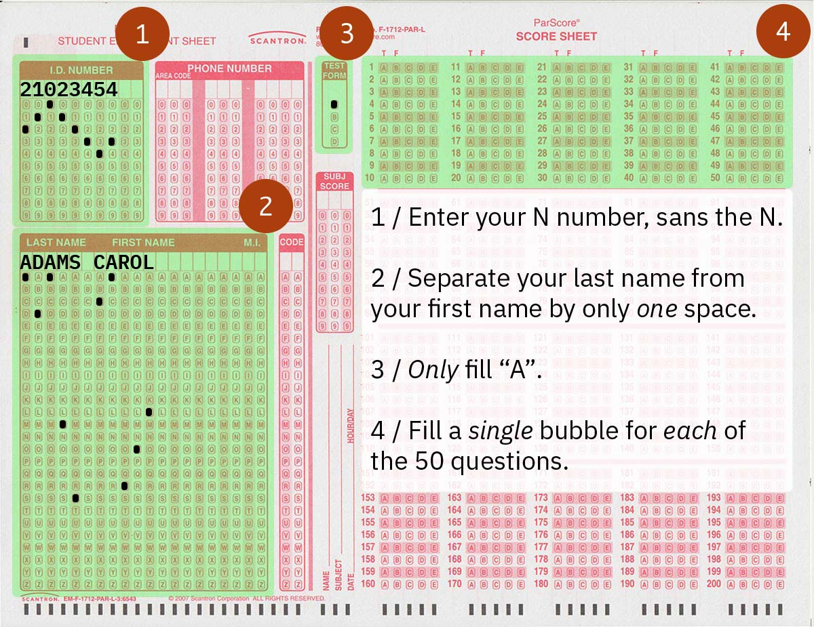

# Scantron Instructions
The included PSD file is designed to display onto a large screen during an exam in order to instruct students on how to fill out a Scantron form. This form is specific to my class at NYU, but you can modify the layers to fit your own needs.

## Contributing
If you’d like to modify the PSD file for your class and share with others, issue a pull request to the `dev` branch.